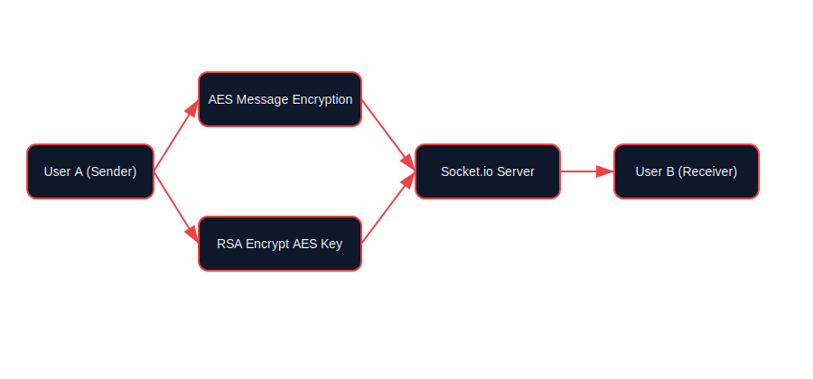

# 🔐 CipherNet — Secure Chat Application Using RSA & AES

<p align="center">
  
  
  
</p>

<p align="center">
  <b>End-to-End Encrypted Real-Time Chat Application</b><br/>
  <i>Hybrid Cryptography • Modern UI • Educational BTS Visualization</i>
</p>

---

## 📌 Objective
To design and develop a **secure real-time chat application** that ensures **end-to-end encrypted communication** using **hybrid cryptography**, combining:

- 🔑 **RSA** for secure key exchange  
- 🔒 **AES** for fast and efficient message encryption  

---

## 👥 Team Members
| Name | Role |
|------|------|
| **Raksha B R** | Developer |
| **Rashmi R Pai** | Developer |
| **Smitha M Dodmane** | Developer |

---

## 📄 Abstract
With the rapid growth of digital communication, ensuring confidentiality and integrity of messages has become critical. **CipherNet** implements a **hybrid cryptographic model** combining **AES (Advanced Encryption Standard)** and **RSA (Rivest–Shamir–Adleman)** to provide strong end-to-end security.

Each message is encrypted using a **unique AES session key**, and this key is encrypted using the **receiver’s RSA public key**. This approach combines the **speed of AES** with the **secure key exchange of RSA**, ensuring protection against eavesdropping, replay attacks, and man-in-the-middle (MITM) attacks.

---

## 🧠 System Architecture


---

## 🔄 Encryption Workflow (Flow Chart)

```mermaid
flowchart LR
    A[Sender] -->|Plain Message| B[AES Encryption]
    B -->|Encrypted Message| C[RSA Encrypt AES Key]
    C -->|Encrypted Payload| D[Server]
    D -->|Forward Payload| E[Receiver]
    E -->|RSA Decrypt AES Key| F[AES Decryption]
    F -->|Plain Message| G[Chat Interface]
🔍 Encryption Sequence Diagram


mermaid
Copy code
sequenceDiagram
    participant Sender
    participant Server
    participant Receiver

    Sender->>Sender: Generate AES Session Key
    Sender->>Sender: Encrypt Message using AES
    Sender->>Sender: Encrypt AES Key using Receiver's RSA Public Key
    Sender->>Server: Send Encrypted Message + Encrypted AES Key
    Server->>Receiver: Forward Encrypted Payload
    Receiver->>Receiver: Decrypt AES Key using RSA Private Key
    Receiver->>Receiver: Decrypt Message using AES
    Receiver->>Receiver: Display Message in UI
🧰 Tech Stack
Layer	Technologies
🖥️ Frontend	React • Vite • Tailwind CSS
⚙️ Backend	Node.js • Express • Socket.io
🗄️ Database	SQLite
🔐 Cryptography	RSA • AES • node-forge

🧪 Behind The Scenes (BTS) — Encryption Breakdown
<details> <summary><b>🔓 Click to view encryption steps</b></summary>
Step 1: AES Session Key Generation
A random AES-256 key is generated per message.

Step 2: Message Encryption
Plaintext message → encrypted using AES.

Step 3: Key Protection
AES key is encrypted using the receiver’s RSA public key.

Step 4: Transmission
Encrypted message + encrypted AES key are sent via server.

Step 5: Decryption
Receiver decrypts AES key using RSA private key and decrypts message using AES.

🔐 Result: Only the intended receiver can read the message.

</details>
🚀 Getting Started
Prerequisites
Node.js (v16+)

Git

Installation & Run
bash
Copy code
# Backend
cd server
npm install
node index.js
bash
Copy code
# Frontend
cd frontend
npm install
npm run dev
Open:

arduino
Copy code
http://localhost:5173
🎓 Educational Value
✔ Demonstrates hybrid cryptography
✔ Visualizes encryption internally (BTS)
✔ Ideal for cryptography courses, final-year projects & viva

🔮 Future Enhancements
Digital signatures for authenticity

Hash-based integrity checks

Cloud deployment

Mobile-friendly UI

📜 License
Developed strictly for academic and educational purposes.

<p align="center"> 🔐 <b>CipherNet — Where Security Meets Simplicity</b> 🔐 </p> ```