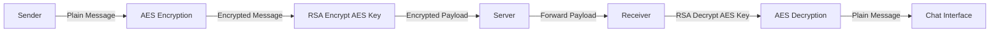

# 🔐 CipherNet — Secure Chat Application Using RSA & AES

  
  
  

  <b>End-to-End Encrypted Real-Time Chat Application</b> 
  <i>Hybrid Cryptography • Modern UI • Educational BTS Visualization</i>

---

## 📌 Objective
To design and develop a **secure real-time chat application** that ensures **end-to-end encrypted communication** using **hybrid cryptography**, combining:

- 🔑 **RSA** for secure key exchange  
- 🔒 **AES** for fast and efficient message encryption  

---

## 👥 Team Members
| Name | Role |
|------|------|
| **Raksha B R** | Developer |
| **Rashmi R Pai** | Developer |
| **Smitha M Dodmane** | Developer |

---

## 📄 Abstract
With the rapid growth of digital communication, ensuring confidentiality and integrity of messages has become critical. **CipherNet** implements a **hybrid cryptographic model** combining **AES (Advanced Encryption Standard)** and **RSA (Rivest–Shamir–Adleman)** to provide strong end-to-end security.

Each message is encrypted using a **unique AES session key**, and this key is encrypted using the **receiver’s RSA public key**. This approach combines the **speed of AES** with the **secure key exchange of RSA**, ensuring protection against eavesdropping, replay attacks, and man-in-the-middle (MITM) attacks.

---

## 🧠 System Architecture

## ⚙️ Tech Stack

| Layer | Technologies |
|------|-------------|
| 🖥️ **Frontend** |        |
| ⚙️ **Backend** |        |
| 🗄️ **Database** |  |
| 🔐 **Cryptography** | )       |

🚀 Getting Started
Prerequisites

Node.js (v16+)

Git

Installation & Run
# Backend
cd server
npm install
node index.js
# Frontend
cd frontend
npm install
npm run dev
Open:http://localhost:5173

